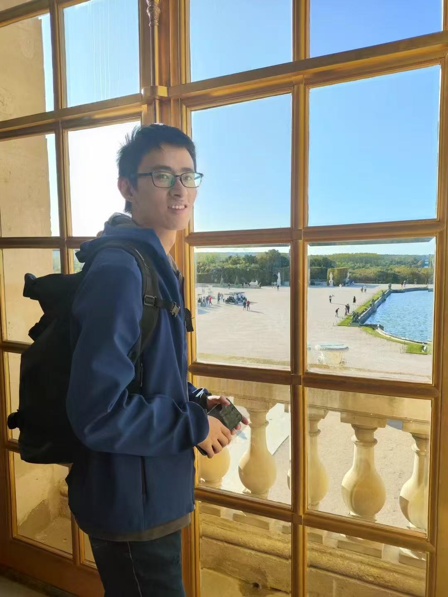

# Bio of Ning Huyan (呼延宁)                               

 

从2024年9月到现在，我就职于清华大学自动化系（博士后），从事动作生成、高光谱影像异常检测相关研究工作。当前我的合作导师是[**刘烨斌**](http://www.liuyebin.com/)教授。我与西安电子科技大学**权豆**副教授保持良好合作关系，并共同开展相关研究工作。2022年5月到2024年8月我曾就职于西安商汤科技有限公司，担任研究员，期间有过一段愉快的工作经历，主要从事基于光学刚体的动作捕捉相关研发相关工作。2019年11月到2020年11月曾在法国格勒诺布尔法国国家信息与自动化研究所访问交流，与[**jocelyn chanussot**](https://jocelyn-chanussot.net/)愉快合作。2011年到2022年在西安电子科技大学分别取得学士和博士学位。攻读博士期间主要跟随西安电子科技大学人工智能学院[**张向荣**](https://web.xidian.edu.cn/xrzhang/)教授, 从事高光谱影像异常检测相关研究工作。

## 研究兴趣:

（高光谱影像）异常检测、稀疏刚体动作捕捉，动作生成。主要涉及技术为深度学习模型（Transformer，ResNet）以及字典学习模型（Low Rank， Dictionary Learning）。

## 论文发表:
* **Ning Huyan**, Dou Quan, Xiangrong Zhang, Xuefeng Liang, Jocelyn Chanussot, Licheng Jiao. **Unsupervised outlier detection using memory and contrastive learning**. EEE Transactions on Image Processing 31, 6440-6454. 2022/10/10.

+ **Abstract:** Outlier detection is to separate anomalous data from inliers in the dataset. Recently, the most deep learning methods of outlier detection leverage an auxiliary reconstruction task by assuming that outliers are more difficult to recover than normal samples (inliers). However, it is not always true in deep auto-encoder (AE) based models. The auto-encoder based detectors may recover certain outliers even if outliers are not in the training data, because they do not constrain the feature learning. Instead, we think outlier detection can be done in the feature space by measuring the distance between outliers’ features and the consistency feature of inliers. To achieve this, we propose an unsupervised outlier detection method using a memory module and a contrastive learning module (MCOD). The memory module constrains the consistency of features, which merely represent the normal data. The contrastive learning module learns more discriminative features, which boosts the distinction between outliers and inliers. Extensive experiments on four benchmark datasets show that our proposed MCOD performs well and outperforms eleven state-of-the-art methods.  [**PDF**](https://ieeexplore.ieee.org/abstract/document/9913887) [**CODE**](https://github.com/huyanning/MCOD)
  
* **Ning Huyan**, Xiangrong Zhang, Dou Quan, Jocelyn Chanussot, Licheng Jiao. **AUD-Net: A unified deep detector for multiple hyperspectral image anomaly detection via relation and few-shot learning**. IEEE Transactions on Neural Networks and Learning Systems 35 (5), 6835-6849. 2022/10/27.
  
+ **Abstract:** This article addresses the problem of the building an out-of-the-box deep detector, motivated by the need to perform anomaly detection across multiple hyperspectral images (HSIs) without repeated training. To solve this challenging task, we propose a unified detector [anomaly detection network (AUD-Net)] inspired by few-shot learning. The crucial issues solved by AUD-Net include: how to improve the generalization of the model on various HSIs that contain different categories of land cover; and how to unify the different spectral sizes between HSIs. To achieve this, we first build a series of subtasks to classify the relations between the center and its surroundings in the dual window. Through relation learning, AUD-Net can be more easily generalized to unseen HSIs, as the relations of the pixel pairs are shared among different HSIs. Secondly, to handle different HSIs with various spectral sizes, we propose a pooling layer based on the vector of local aggregated descriptors, which maps the variable-sized features to the same space and acquires the fixed-sized relation embeddings. To determine whether the center of the dual window is an anomaly, we build a memory model by the transformer, which integrates the contextual relation embeddings in the dual window and estimates the relation embeddings of the center. By computing the feature difference between the estimated relation embeddings of the centers and the corresponding real ones, the centers with large differences will be detected as anomalies, as they are more difficult to be estimated by the corresponding surroundings. Extensive experiments on both the simulation dataset and 13 real HSIs demonstrate that this proposed AUD-Net has strong generalization for various HSIs and achieves significant advantages over the specific-trained detectors for each HSI.  [**PDF**](https://ieeexplore.ieee.org/abstract/document/9931456) [**CODE**](https://github.com/huyanning/AUD-Net)
  
* **Ning Huyan**, Xiangrong Zhang, Huiyu Zhou, Licheng Jiao. **Hyperspectral anomaly detection via background and potential anomaly dictionaries construction**. IEEE Transactions on Geoscience and Remote Sensing 57 (4), 2263-2276. 2018/11/1.
  
+ **Abstract:** In this paper, we propose a new anomaly detection method for hyperspectral images based on two well-designed dictionaries: background dictionary and potential anomaly dictionary. In order to effectively detect an anomaly and eliminate the influence of noise, the original image is decomposed into three components: background, anomalies, and noise. In this way, the anomaly detection task is regarded as a problem of matrix decomposition. Considering the homogeneity of background and the sparsity of anomalies, the low-rank and sparse constraints are imposed in our model. Then, the background and potential anomaly dictionaries are constructed using the background and anomaly priors. For the background dictionary, a joint sparse representation (JSR)-based dictionary selection strategy is proposed, assuming that the frequently used atoms in the overcomplete dictionary tend to be the background. In order to make full use of the prior information of anomalies hidden in the scene, the potential anomaly dictionary is constructed. We define a criterion, i.e., the anomalous level of a pixel, by using the residual calculated in the JSR model within its local region. Then, it is combined with a weighted term to alleviate the influence of noise and background. Experiments show that our proposed anomaly detection method based on potential anomaly and background dictionaries construction can achieve superior results compared with other state-of-the-art methods.  [**PDF**](https://ieeexplore.ieee.org/abstract/document/8519775)
  
* **Ning Huyan**, Xiangrong Zhang, Dou Quan, Jocelyn Chanussot, Licheng Jiao. **Cluster-memory augmented deep autoencoder via optimal transportation for hyperspectral anomaly detection**. IEEE Transactions on Geoscience and Remote Sensing 60, 1-16. 2022/6/6.

+ **Abstract:** Hyperspectral anomaly detection (AD) aims to detect objects significantly different from their surrounding background. Recently, many detectors based on autoencoder (AE) exhibited promising performances in hyperspectral AD tasks. However, the fundamental hypothesis of the AE-based detector that anomaly is more challenging to be reconstructed than background may not always be true in practice. We demonstrate that an AE could well reconstruct anomalies even without anomalies for training, because AE models mainly focus on the quality of sample reconstruction and do not care if the encoded features solely represent the background rather than anomalies. If more information is preserved than needed to reconstruct the background, the anomalies will be well reconstructed. This article proposes a cluster-memory augmented deep autoencoder via optimal transportation for hyperspectral anomaly detection (OTCMA) clustering for hyperspectral AD to solve this problem. The deep clustering method based on optimal transportation (OT) is proposed to enhance the features consistency of samples within the same categories and features discrimination of samples in different categories. The memory module stores the background’s consistent features, which are the cluster centers for each category background. We retrieve more consistent features from the memory module instead of reconstructing a sample utilizing its own encoded features. The network focuses more on consistent feature reconstruction by training AE with a memory module. This effectively restricts the reconstruction ability of AE and prevents reconstructing anomalies. Extensive experiments on the benchmark datasets demonstrate that our proposed OTCMA achieves state-of-the-art results. Besides, this article presents further discussions about the effectiveness of our proposed memory module and different criteria for better AD.  [**PDF**](https://ieeexplore.ieee.org/abstract/document/9789180) [**CODE**](https://github.com/huyanning/OTCMA-Net)

## 工作经历:

* 09/2024 - 至今:    博士后， 清华大学自动化系，北京，中国。

* 08/2024 - 05/2022: 算法研究员， 西安商汤智能科技有限公司， 陕西西安，中国。

* 06/2022 - 09/2011: 学士—博士， 西安电子科技大学，陕西西安，中国。

## 奖项:

* Achieved **[First Place Award](https://www.aicitychallenge.org/?page_id=13)** on Track2: Anomaly Detection on NVIDIA AI CITY CHALLENGE from **CVPR 2018 workshop**. (**[Team 15](https://github.com/bruinxiong/xionglin.github.io/blob/master/NVIDIA_AI_CITY_CHALLENGE.jpg)**).

* Achieved **Gold prize[1](https://github.com/bruinxiong/xionglin.github.io/blob/master/Gold_Award.jpg),[2](https://github.com/bruinxiong/xionglin.github.io/blob/master/PTS_2017_Gold_award_CTO.jpg)** award in Panasonic Technology Symposium **(PTS 2017)** held by Headquarter of Panasonic, Osaka. **(No.1 of 21 competitors, 4.8%)**

* Achieved the **World's most accurate** Face Recognition based on the IJB-A dataset provided by NIST and obtained an **[award prize](https://github.com/bruinxiong/xionglin.github.io/blob/master/Award_Panasonic_SG.pdf)** from Panasonic R&D Center Singapore, 2017

* Achieved the **[First Place Award](https://github.com/bruinxiong/xionglin.github.io/blob/master/Award_MS.pdf)** on Track1: Recognizing One Million Celebrities(with external Data) from **ICCV 2017 workshop**.

## CV:

More detailed information can be found in my **[full_CV](https://github.com/bruinxiong/xionglin.github.io/blob/master/XiongLinCV_full_v4.pdf)**.

## Hobbies:

Photography, [Travel](https://github.com/bruinxiong/xionglin.github.io/blob/master/Shin_Yokohama.jpg), Figures collection ([Saint_Seiya](https://github.com/bruinxiong/xionglin.github.io/blob/master/Saint_Seiya.jpg), [Mazinger](https://github.com/bruinxiong/xionglin.github.io/blob/master/Mazinger.jpg) and [MB_Gundam](https://github.com/bruinxiong/xionglin.github.io/blob/master/MB_Gundam.jpg) so on), LEGO and Cooking.

## Contact:

**Email:** lin.xiong@smartic.ai, bruinxiong@me.com, bruinxiongmac@gmail.com

**Phone:** +86 18092636295, +1 669 454 6698 

**WeChat:** bruinxiongmac

**Address:** SooChow, China.

## News and Activities:

**Mar 2025:** One paper titled with **Cross-Rejective Open-Set SAR Image Registration** is accepted by ***CVPR 2025***.

**Sep 2023:** One paper titled with **RGMIL: Guide Your Multiple-Instance Learning Model with Regressor** is accepted by ***NeurIPS 2023***. 

**Mar 2023:** One paper titled with **Surrogate-assisted multi-objective optimization via knee-oriented Pareto front estimation** is accepted by **Swarm and Evolutionary Computation**.

**Jan 2023:** One paper titled with **Adaptive Self-Supervised SAR Image Registration With Modifications of Alignment Transformation** is accepted by **TGRS**.

**Jun 2021:** One [paper](https://github.com/bruinxiong/xionglin.github.io/blob/master/Multi-scale_Fused_SAR_Image_Registration_based_on_Deep_Forest_Remote_Sensing_2021.pdf) titled with **Multi-scale Fused SAR Image Registration based on Deep Forest** is accepted by **Remote Sensing**.

**Aug 2020:** To be a **member of the Program Committee (PC)** for **AAAI 2021**, the 35th AAAI Conference on Artificial Intelligence, Feb 2-9 in a virtual conference.

**Oct 2019:** One [paper](https://github.com/bruinxiong/xionglin.github.io/blob/master/Recognizing_Profile_Faces_by_Imagining_Frontal_View_IJCV_2019.pdf) titled with **Recognizing Profile Faces by Imagining Frontal View** is accepted by **IJCV**.

**Aug 2019:** To be a **member of the Program Committee (PC)** for **AAAI 2020**, the 34th AAAI Conference on Artificial Intelligence, Feb 7-12 in New York, NY, USA.

**Nov 2018:** My former employer, **Panasonic R&D Center Singapore**, has just achieved the **[No.6](https://github.com/bruinxiong/xionglin.github.io/blob/master/NIST_PSL_01.jpg)** in Wild Setting of fierce **NIST Face Recognition Vendor Test (FRVT) 1:1 Verification**. It proves that our previous strategies for wild setting are shown to be correct. This score is the same as the No.1 of three months ago. Many competitors get large improvement. It is a fiercely competitive battle field of face recognition. Congratulations, my friends and the former boss **[Ms. Shen](https://www.linkedin.com/in/jane-shen-b93a266b/?originalSubdomain=sg)**. More information can be found in the offical **[report](https://www.nist.gov/system/files/documents/2019/01/29/frvt_report_2019_01_29.pdf)**. 

**Nov 2018:** One [paper](https://arxiv.org/pdf/1809.00338.pdf) titled with **Look Across Elapse: Disentangled Representation Learning and
Photorealistic Cross-Age Face Synthesis for Age-Invariant Face Recognition** is accepted by ***AAAI 2019***.

**Aug 2018:** Panasonic releases a news for new facial recognition system ***["FacePRO"](https://www.youtube.com/watch?v=ce1LSxZCK0M)*** integrated with our face recognition algorithm.

**Jul 2018:** One [paper](https://github.com/bruinxiong/xionglin.github.io/blob/master/3D-Aided_Dual-Agent_GANs_for_Unconstrained_Face_Recognition_TPAMI_2018.pdf) titled with **3D-Aided Dual-Agent GANs for Unconstrained Face Recognition** is accepted by **TPAMI**.

**Jun 2018:** We submit our first API (psl) submission to **NIST FRVT 1:1 Verification**, the leaderboard can be found in [here](https://www.nist.gov/programs-projects/face-recognition-vendor-test-frvt-ongoing). We will continue to improve our model in the future, especially for WILD Setting. 

**May 2018:** We release the evaluation [codes](https://github.com/bruinxiong/Evaluation_IJBA) for **IJB-A with open and close protocols**. Anybody can reproduce our results based on single ResNext 152 model.

**Apr 2018:** One [paper](https://www.researchgate.net/publication/324557770_3D-Aided_Deep_Pose-Invariant_Face_Recognition) is accepted by ***IJCAI 2018***.

**Apr 2018:** One [paper](https://www.researchgate.net/publication/324746337_Dual-Mode_Vehicle_Motion_Pattern_Learning_for_High_Performance_Road_Traffic_Anomaly_Detection) is accepted by ***CVPR 2018 Workshop of NVIDIA AI City Challenge***.

**Feb 2018:** One [paper](https://www.researchgate.net/publication/323446132_Towards_Pose_Invariant_Face_Recognition_in_the_Wild) is accepted by ***CVPR 2018***.

**Feb 2018:** Panasonic releases a ***[news,Japanese,](http://news.panasonic.com/jp/press/data/2018/02/jn180220-1/jn180220-1.html)[English](http://news.panasonic.com/global/press/data/2018/02/en180220-3/en180220-3.html?utm_source=domo&utm_medium=webpush&utm_campaign=panasonic-newsroom-global_20180220&utm_content=20180220-1)*** for a pre-release of new product integrated with our face recognition algorithm. ***[News on Youtube 1,](https://www.youtube.com/watch?v=SOTVU3f0xNo&t=9s)[News on Youtube 2,](https://www.youtube.com/watch?v=Z5vxhhM0JGQx)[News on Youtube 3.](https://www.youtube.com/watch?v=J_-iRx7z1qQ)*** 

**Feb 2018:** Our method has achieved ***TAR = 0.959 @ FAR = 0.0001*** for 1:1 verification and ***TPIR = 0.946 @ FPIR = 0.01*** for 1:N open-protocol identification on **IJB-A**. (***Top 1 performance*** in current state-of-the-art methods).

**Jan 2018:** As a Chinese Tech-oriented media, AI Era gave a ***[full interview](https://mp.weixin.qq.com/s/s9H_OXX-CCakrTAQUFDm8g)*** for our NIST IJB-A Face Challenge. Our latest performance of IJB-A will be updated in the next version of our **[arXiv](https://arxiv.org/abs/1704.00438v2)** paper. ***(New update)*** 

**Jul 2017:** We attended [MS-Celeb-1M Large-Scale Face Recognition](http://www.msceleb.org/) with our proposed face recognition [algorithm](http://openaccess.thecvf.com/content_ICCV_2017_workshops/papers/w27/Xu_High_Performance_Large_ICCV_2017_paper.pdf) and archieved No.1 place on Challenge-1 [Random Set and Hard Set](http://www.msceleb.org/leaderboard/iccvworkshop-c1). AI Era gave an [interview](http://www.sohu.com/a/160503484_473283) for this challenge.

**May 2017:** One [paper](http://papers.nips.cc/paper/6612-dual-agent-gans-for-photorealistic-and-identity-preserving-profile-face-synthesis.pdf) is accepted by ***NIPS 2017***.

**May 2017:** Panasonic released a ***[news](http://news.panasonic.com/jp/press/data/2017/05/jn170510-5/jn170510-5.html)*** to introduce our project and report our archievement on IJB-A Face Verification and Identification Challenge. Moreover, ***[CNET Japan](https://japan.cnet.com/article/35100942/)*** also picked up the story.

**Apr 2017:** We proposed Transferred Deep Feature Fusion (TDFF) for face recogntion and obtained **No.1** place on all tracks of National Institute of Standards and Technology (**NIST**) IARPA Janus Benchmark A (
**IJB-A**) Unconstrained Face Verification and Identification Challenge. Official reports can be found in here: [Identification](https://github.com/bruinxiong/xionglin.github.io/blob/master/IJBA_1N_report.pdf) and [Verification](https://github.com/bruinxiong/xionglin.github.io/blob/master/IJBA_11_report.pdf) 
